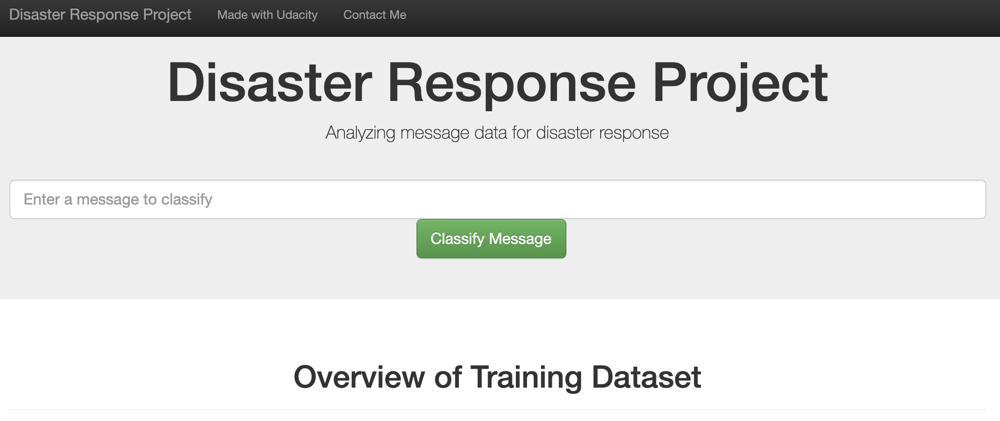
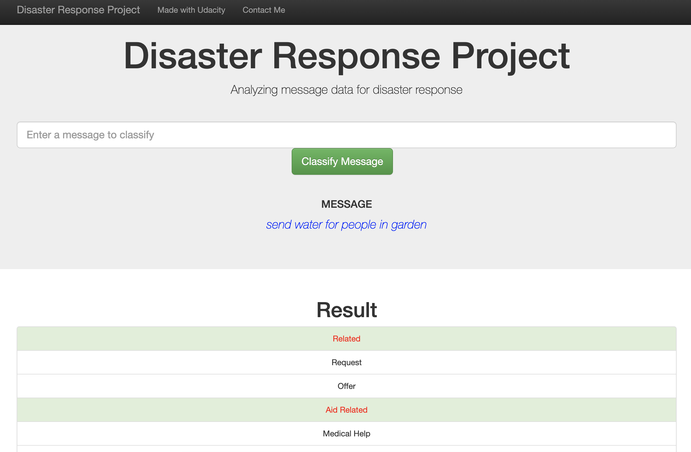

# Disaster Response Pipeline Project

This is a projetct is a END-TO-END pipeline to creat a machine learning project
with a front-end interface to used.


### Instructions:

## 1. Virtualenv

create virtualenv
```
python3 -m venv .env
source .env/bin/activate
```

install requirements

```
pip install -r requirements.txt
```


## 2. Run projetct

1. Run the following commands in the project's root directory to set up your database and model.

    - To run ETL pipeline that cleans data and stores in database
        `python data/process_data.py data/disaster_messages.csv data/disaster_categories.csv data/DisasterResponse.db`
    - To run ML pipeline that trains classifier and saves
        `python models/train_classifier.py data/DisasterResponse.db models/classifier.pkl`

2. Run the following command in the app's directory to run your web app.
    `python app/run.py`

3. Go to http://0.0.0.0:3001/

# Example Web

## Intro page



## Example output



# Overview Project

This project have a follow paths: 

**app**, with all files for 
[flask](https://flask.palletsprojects.com/en/1.1.x/) web-server run.

**data**. with all files for create a database used for ML process.

**image** images for readme

**models** with all files for create a ML model.

This project have a follow files in home: 
**requirements.txt** all lib for run this project


``` 
├── README.md
├── app
│   ├── __init__.py
│   ├── run.py
│   └── templates
│       ├── go.html
│       └── master.html
├── data
│   ├── __init__.py
│   ├── disaster_categories.csv
│   ├── disaster_messages.csv
│   └── process_data.py
├── image
│   ├── intro.png
│   └── pesquisa.png
├── models
│   ├── __init__.py
│   ├── classifier.pkl
│   └── train_classifier.py
└── requirements.txt
``` 